# Phase 2: Org Setup & Configuration

## 1. Salesforce Edition Setup
- Using Salesforce Developer Edition (free, suitable for capstone projects).
- Org named “GreenTrack Sustainability Portal”.

## 2. Company Profile Setup
- Company Info: GreenTrack | Industry: Environmental Sustainability.
- Locale Settings: Default to India (GMT +5:30, INR currency).
- Business Hours & Holidays:
    Business hours: 9 AM – 6 PM (for activity/event scheduling).
    Holidays: Added national holidays to simulate event blackout dates.
- 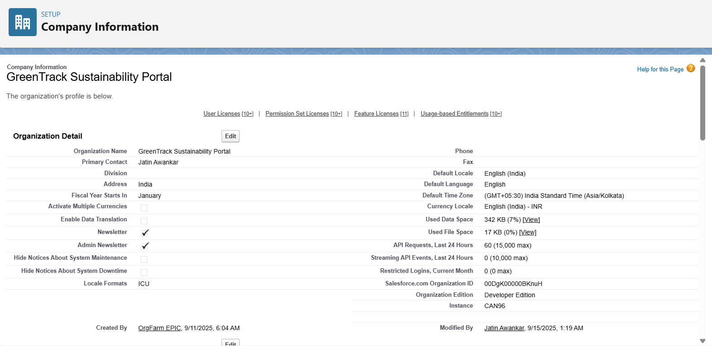

## 3. Fiscal Year Settings
- Standard fiscal year setup → Jan–Dec.
- Activities & CO₂ impact will be tracked quarterly and yearly.
- 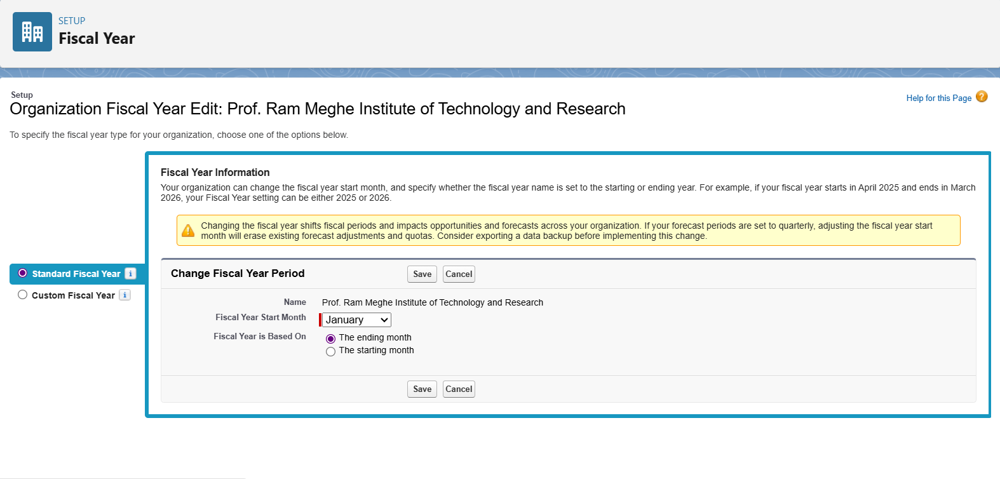

## 4. User Setup & Licenses
- Profiles Created:
- System Admin (default).
- 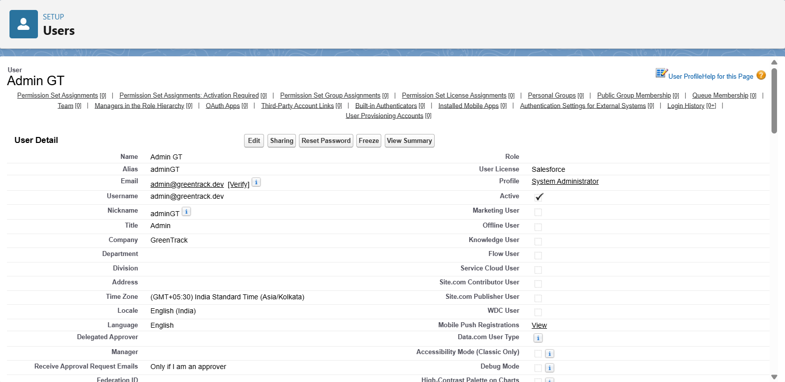
- NGO Manager Profile → Manage activities & dashboards.
- 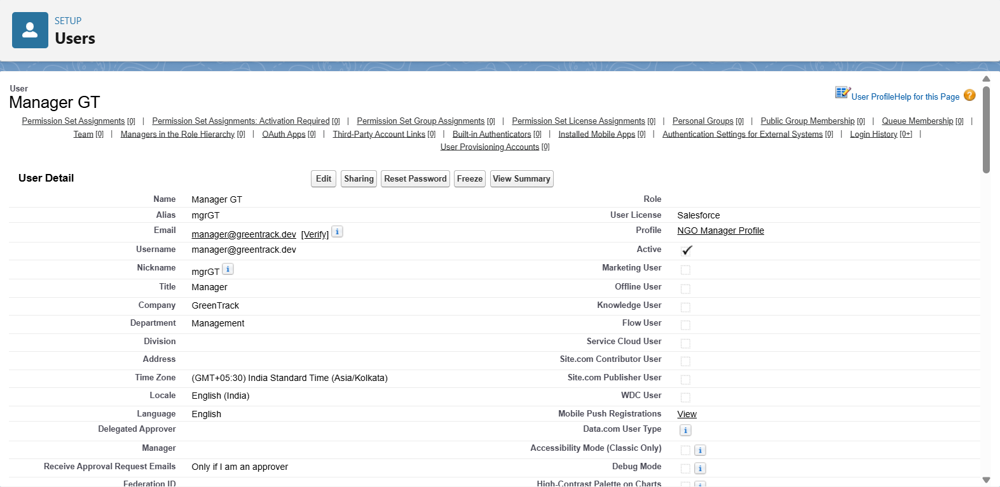
- Participant Profile → Log activities, view own impact.
- 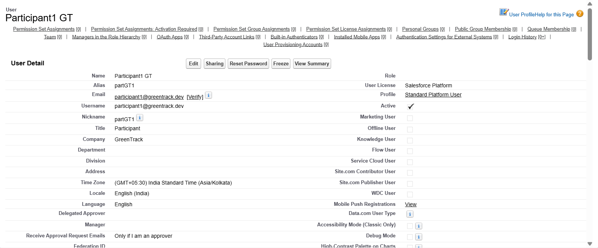
- Licenses Assigned: Salesforce Platform license for non-admin users.

## 5. Roles & Hierarchy
- Admin (highest)  
    ↳ NGO Manager  
    ↳ Participants

- Ensures data visibility rolls up for monitoring but stays restricted at participant level.
- 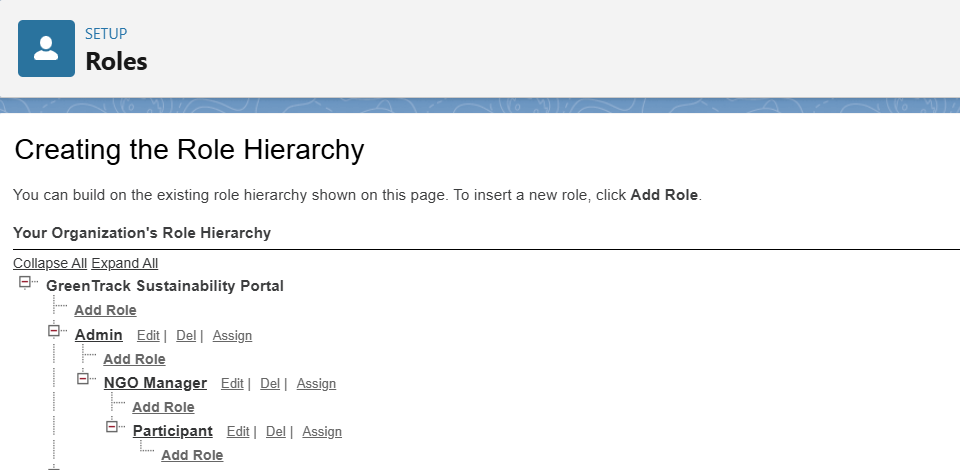
- 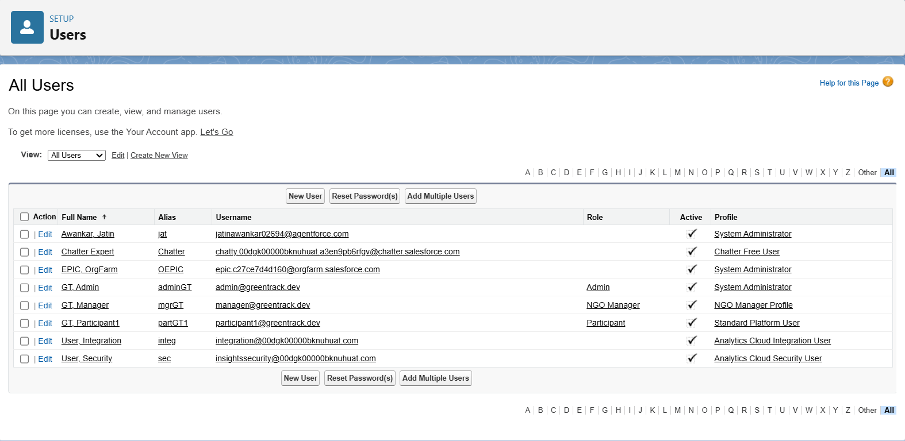

## 6. Permission Sets
- Badge Assignment Access → Grants managers ability to update badges.
- 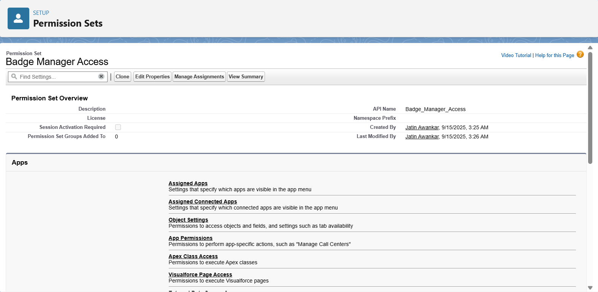
- Dashboard Viewer → Grants participants access to view sustainability dashboards.
- 

## 7. Security Settings (OWD & Sharing Rules)
- OWD (Organization-Wide Defaults):
- 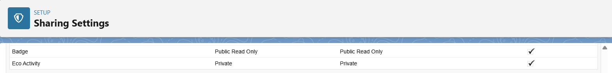
- Eco Activities → Public Read/Write (anyone can log activities).
- Impact Scores → Private (only user & managers can see).
- Badges → Read-only for participants, editable by managers.
- Sharing Rules:
    Allow NGO Managers to see all participant activities.
- 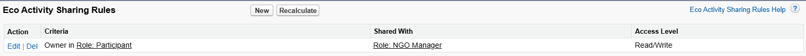

## 8. Login Access Policies
- IP ranges restricted to simulate internal org use.
- Session timeout set to 1 hour for security.
- 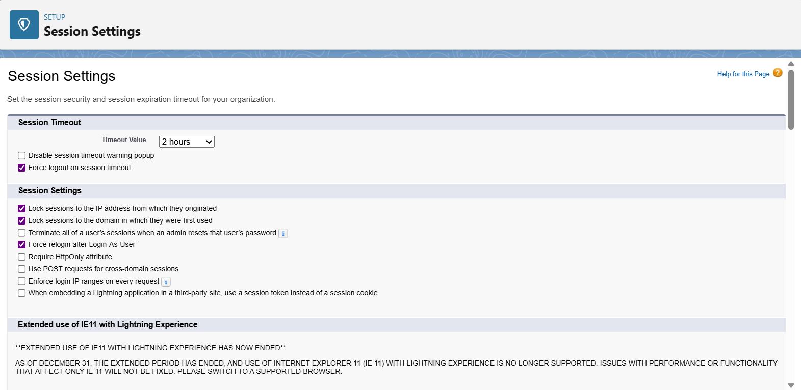

## 9. Admin email & case setup (notifications)
- Why: flows/alerts will send emails — ensure sender addresses exist.
- 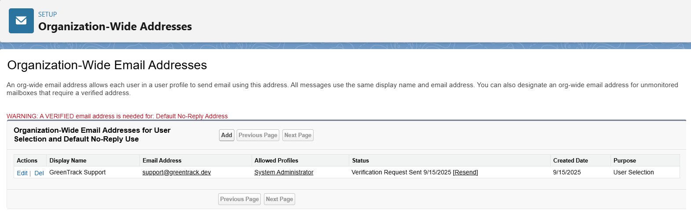

## 10. App Shell (create a Lightning App for GreenTrack)
- Isolates the project in the App Launcher.
- Gives a nice demo experience.
- 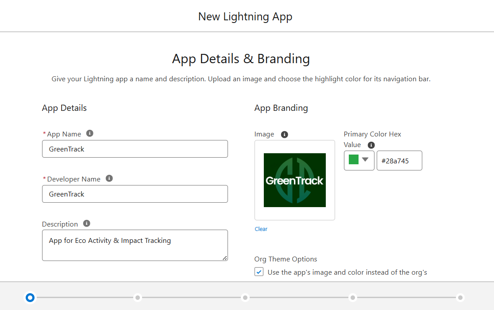

## 11. Dev Org Setup & Sandbox Usage
- Primary development in Developer Org.
- (Optional) Sandbox for testing advanced automation before final deployment.

## 12. Deployment Basics
- Change Sets prepared for future migration (Flows, Objects, Dashboards).
- Version control with GitHub repository (docs + metadata).
