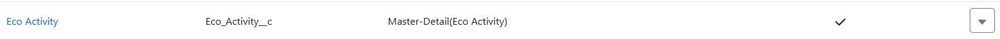

# Phase 3: Data Modeling & Relationships (GreenTrack)

## 1) What is Data Modeling in Salesforce?
Data Modeling = Designing Objects, Fields, and Relationships to represent your business logic. 
Think of it as the blueprint for your database inside Salesforce. 
- In GreenTrack, we need to capture:
  - Who did something? (User / Participant)
  -	What activity did they do? (Eco Activity)
  - What’s the calculated impact? (Impact Score)
  - What recognition did they get? (Badge)

## 2) Identify Custom Objects
Go to: Setup → Object Manager → Create → Custom Object 
Create these:
### 1) Eco Activity (Eco_Activity__c)
	Represents sustainability events logged by users. 
	- Key Fields:
		- Activity Name (Text)
		- Activity Type (Picklist → Tree Plantation, Recycling, Awareness Drive)
		- Date (Date)
		- Location (Text)
		- Trees Planted (Number)
		- Waste Recycled (Number in kg)
		- Description (Long Text Area)
  
  
### 2) Impact Score (Impact_Score__c)
   	Stores CO₂ savings (auto-calculated from activities). 
	- Key Fields:
		- Total CO₂ Saved (Formula: e.g., Trees_Planted * 21 + Waste_Recycled * 1.5)
		- Level (Picklist: Beginner, Intermediate, Champion)
  
  
### 3) Badge (Badge__c)
   	Recognition awarded to participants. 
	- Key Fields:
		- Badge Name (Bronze, Silver, Gold, Platinum)
		- Awarded Date (Date)
  

## 3) Standard Objects Used
- User (Standard Object): Participants and NGO Managers.
- Reports & Dashboards (Standard): For analytics.

## 4) Define Relationships
Open Schema Builder (Setup → Quick Find → Schema Builder). 
Relationships:
- User ↔ Eco Activity: Lookup (one user can log many activities).
- 
- Eco Activity ↔ Impact Score: Master-Detail (each activity contributes to a score record).
- 
- User ↔ Badge: Lookup (user may earn multiple badges).
- 

Use Master-Detail when the child should depend on the parent (Impact Score tied to Activity). Use Lookup when records can live independently (Badge can exist without User temporarily).

## 5) Record Types (Optional but adds clarity)
Create Record Types for Eco Activity:
- Tree Plantation
- Recycling
- Awareness Drive

This allows different Page Layouts (e.g., “Trees Planted” field only shows for Tree Plantation).

## 6) Page Layouts
- Eco Activity Layout: Show Activity details, Trees Planted/Waste Recycled.
- Impact Score Layout: Show total CO₂ saved, level.
- Badge Layout: Show badge name, awarded date, related user.

Add related lists so managers can see Activities logged under User and Badges earned.

## 7) Compact Layouts
- Compact Layout for Eco Activity → Display: Activity Type, Date, Location, Trees Planted.
- Makes mobile & Lightning UI concise.

## 8) Validation Rules
Create validation rules to maintain clean data:
#### Example:
	Trees must be > 0 for Tree Plantation:
	AND(
  		ISPICKVAL(Activity_Type__c, "Tree Plantation"),
  		OR(ISBLANK(Trees_Planted__c), Trees_Planted__c <= 0)
	)
	Error Message: “Please enter a valid number of trees planted.”

## 9) Deliverables for Phase 3
1) Custom Objects created (Eco Activity, Impact Score, Badge).
2) Fields added (Activity details, CO₂ saved formula).
3) Relationships defined (User ↔ Activity ↔ Impact Score; User ↔ Badge).
4) Schema Diagram (screenshot from Schema Builder).
5) Validation Rules implemented.
6) Page Layouts configured.
7) GitHub commit: phase3: data model objects, fields, relationships, validation rules.

## 10) Testing Checklist
- Log in as a Participant → Create Eco Activity (Tree Plantation).
- Verify Impact Score auto-calculates CO₂ saved.
- Verify Badge is not directly editable by the Participant.
- Switch to NGO Manager → See all participant activities.
- Check compact layout on mobile preview.

