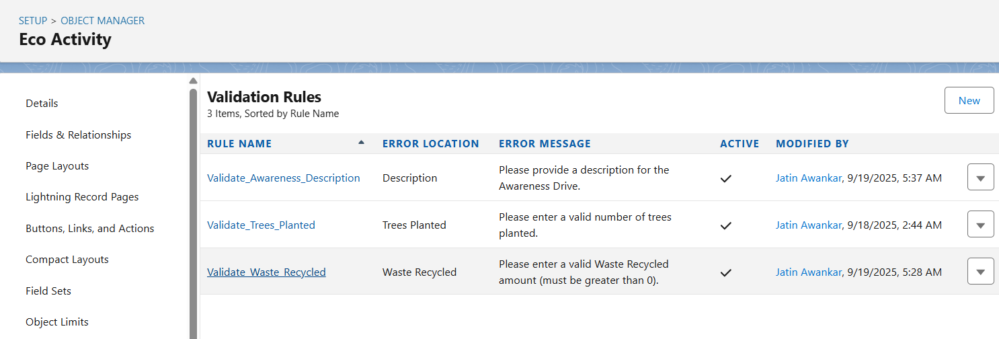
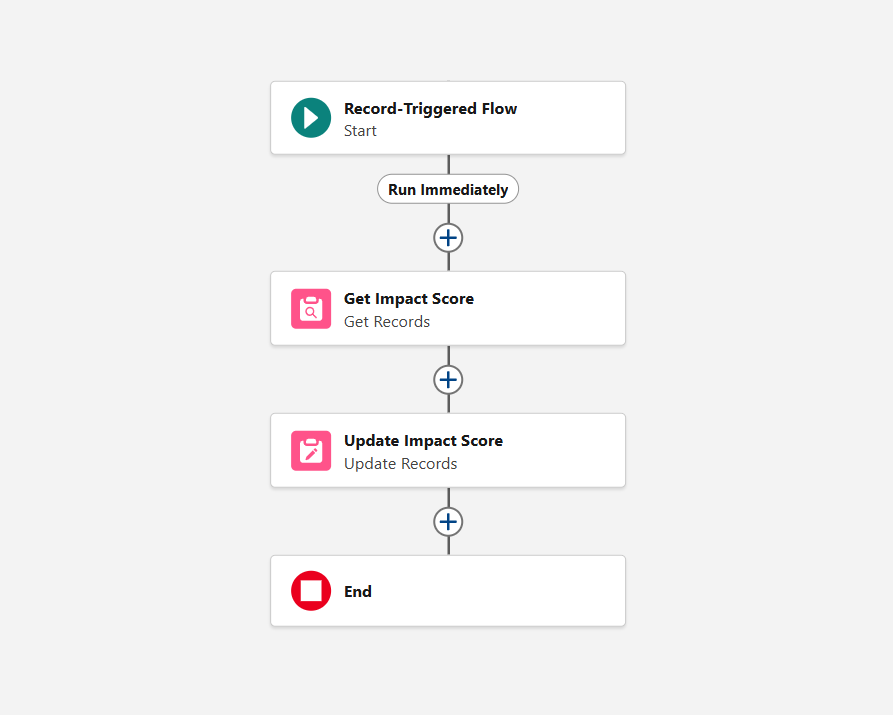
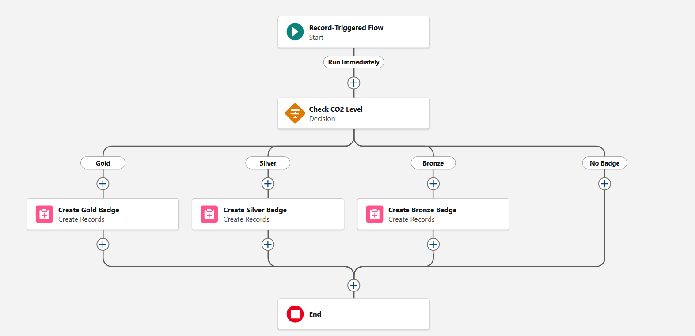
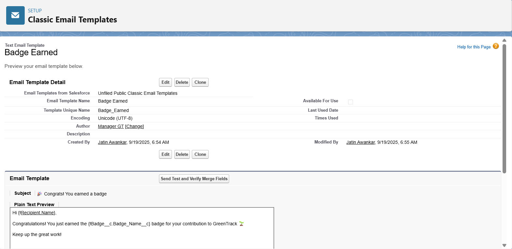
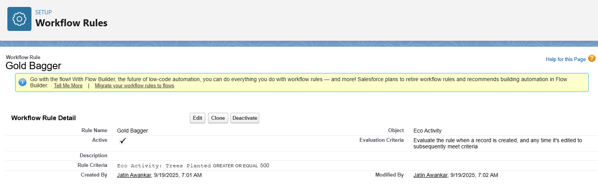

# Phase 4: Process Automation (Admin)


## 1) Why Automation?
Without automation, users would have to manually calculate CO₂ saved, assign badges, and send notifications. That’s error-prone and boring. Automation ensures consistency, efficiency, and engagement.


## 2) Validation Rules
- Purpose: Prevent bad data entry.
- 📍Example: Trees must be > 0 for Tree Plantation
    - Go to: Setup → Object Manager → Eco Activity → Validation Rules → New
    - Rule Name: Validate_Trees_Planted
    - Formula:
      ```
      AND(
          ISPICKVAL(Activity_Type__c, "Tree Plantation"),
          OR(ISBLANK(Trees_Planted__c), Trees_Planted__c <= 0)
      )
      Error Message: “Please enter a valid number of trees planted.”
      ```

👉 Similarly, create for Waste Recycled: must be > 0 when Activity Type = Recycling.
    

## 3) Flow Builder – CO₂ Calculation
- Purpose: Auto-calculate CO₂ saved when an Eco Activity is created.
- Go to: Setup → Flow → New Flow → Record-Triggered Flow
    - Object: Eco Activity
    - Trigger: When record is created or updated
    - Logic:
        Formula for CO₂ saved =
        ```(Trees_Planted__c * 21) + (Waste_Recycled__c * 1.5)```
- Update field CO2_Saved__c in Impact Score.



## 4) Flow Builder – Badge Assignment
- Purpose: Award badges automatically when thresholds are met.
- Go to: Flow → New Flow → Record-Triggered Flow
    - Object: Impact Score
    - Trigger: When record updated
    - Logic:
        ```
        IF CO₂ Saved ≥ 1000 → Create Badge (Gold)
        IF CO₂ Saved ≥ 500 → Create Badge (Silver)
        ELSE IF CO₂ Saved ≥ 100 → Create Badge (Bronze)
        ```
    - Assign the Badge to related User.


## 5) Email Alerts & Custom Notifications
- Purpose: Motivate users.
- Email Alert:
    - Setup → Email Alerts → New.
    - Example: Send email “Congrats! You earned a badge 🎉” to the Participant when a Badge record is created.
    - 
- Custom Notification (Lightning):
    - Setup → Notification Builder → Custom Notifications.
    - Create “GreenTrack Milestone Reached.”
- Trigger via Flow → When a new Badge is assigned, send notification.


## 6) Workflow Rules / Process Builder
📌 Note: Salesforce is moving away from Workflow Rules & Process Builder in favor of Flows.
 Still, for academic completeness:
- Workflow Rule Example: Send email to NGO Manager when an Eco Activity > 500 Trees is logged.


## 7) Approval Process (Optional)
- Example: Big activities (e.g., more than 1000 trees logged) → Require Manager approval before Impact Score updates.
- Setup → Approval Processes → New Approval Process.


## 8) Deliverables for Phase 4
- Validation Rules: Tree Plantation, Recycling, etc.
- Flows:
    - CO₂ Calculation Flow.
    - Badge Assignment Flow.
    - Notification Flow.
    - Email Alerts & Custom Notifications.
    - Optional Workflow Rule / Approval Process.

GitHub Commit: phase4: flows, validation rules, automation.


## 9) Testing Checklist
- Log in as a Participant → Create Activity (Tree Plantation, 10 trees).
- Verify CO₂ saved auto-calculated = 210kg.
- Log activity with 600 trees → Verify Silver Badge auto-assigned + email sent.
- Try entering invalid values → Validation Rule blocks.
- NGO Manager receives notification for large activity.
