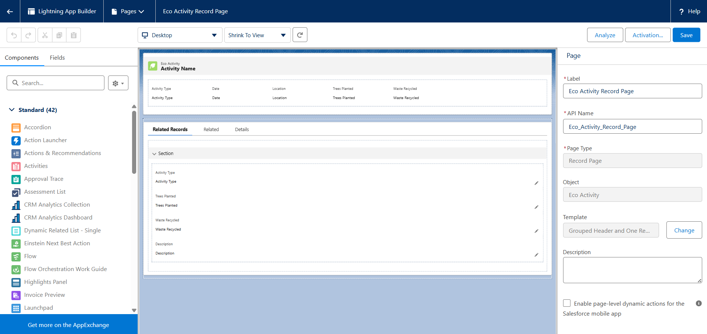
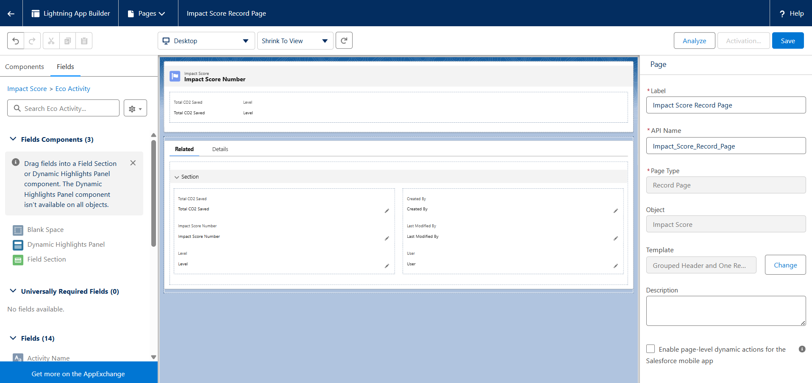
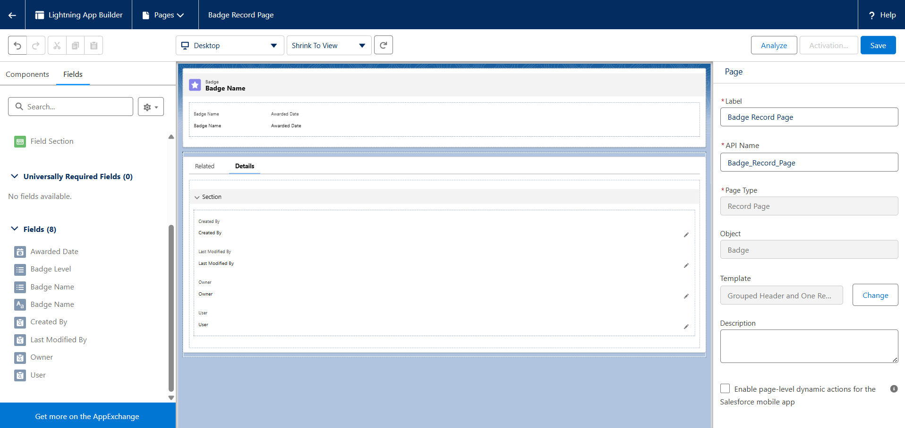
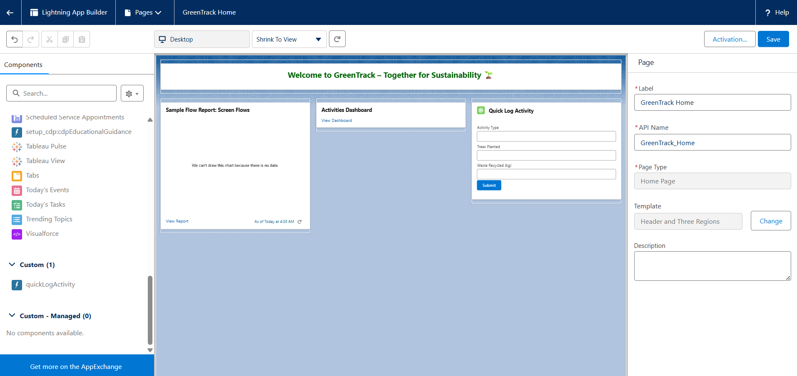
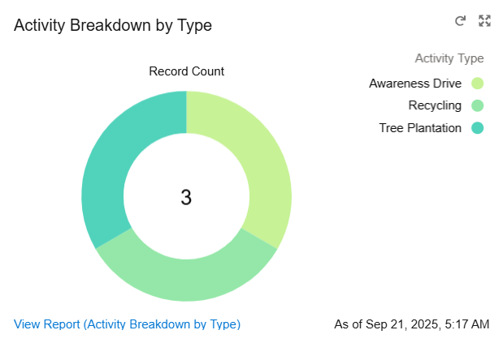

# Phase 6: User Interface Development


## 1) Create a Lightning App for GreenTrack
- 📍 Purpose: A dedicated workspace where users see only project-related tabs.
- Go to: Setup → App Manager → New Lightning App
  - Name: GreenTrack
  - Branding: Add green/eco-friendly color theme.
  - Navigation Items (Tabs):
      - Eco Activities
      - Impact Scores
      - Badges
  - Dashboards
  - Assign Profiles: Admin, NGO Manager, Participant

👉 This ensures everyone uses the same branded app.


## 2) Create Tabs
- 📍 Purpose: Give users direct access to custom objects.
- Setup → Tabs → New → Choose Object → Eco Activity, Impact Score, Badge
- Add to GreenTrack App


## 3) Record Pages (Lightning App Builder)
- 📍 Purpose: Customize how object records look.
- Setup → Object Manager → Eco Activity → Lightning Record Pages → New
  - Add components:
  - Activity Details section (Type, Date, Location)
  - 
  - Impact Score (related list)
  - 
  - Badges (related list)
  - 


## 4) Home Page Layout
- 📍 Purpose: Give users an engaging landing page.
- Setup → Lightning App Builder → New Home Page
- Add:
  - Welcome Text (“Welcome to GreenTrack – Together for Sustainability 🌱”)
  - Report Chart: Monthly CO₂ Saved
  - Dashboard Component: Top 5 Contributors



## 5) Utility Bar (Optional but adds flair)
- 📍 Purpose: Quick access to features at the bottom bar.
- Setup → App Manager → GreenTrack → Edit → Utility Bar
- Add:
  - Notes (quick meeting notes)
  - Recent Items (Eco Activities)
  - Custom LWC (Quick Log Activity form – explained below).


## 6) Lightning Web Component (LWC) – Quick Log Activity
- 📍 Purpose: Coding + Usability.
- File Structure:
  ```
  lwc/
   └── quickLogActivity/
       ├── quickLogActivity.html
       ├── quickLogActivity.js
       └── quickLogActivity.js-meta.xml
  ```
  
- quickLogActivity.html
  ```
  <template>
    <lightning-card title="Quick Log Activity" icon-name="custom:custom63">
      <div class="slds-p-around_medium">
        <lightning-input label="Activity Type" type="text" value={activityType} onchange={handleChange}></lightning-input>
        <lightning-input label="Trees Planted" type="number" value={treesPlanted} onchange={handleChange}></lightning-input>
        <lightning-input label="Waste Recycled (kg)" type="number" value={wasteRecycled} onchange={handleChange}></lightning-input>
        <lightning-button label="Submit" onclick={handleSubmit} variant="brand"></lightning-button>
      </div>
    </lightning-card>
  </template>
  ```

- quickLogActivity.js
  ```
  import { LightningElement, track } from 'lwc';
  import { ShowToastEvent } from 'lightning/platformShowToastEvent';
  import ECO_OBJECT from '@salesforce/schema/Eco_Activity__c';
  import ACTIVITY_TYPE from '@salesforce/schema/Eco_Activity__c.Activity_Type__c';
  import TREES_PLANTED from '@salesforce/schema/Eco_Activity__c.Trees_Planted__c';
  import WASTE_RECYCLED from '@salesforce/schema/Eco_Activity__c.Waste_Recycled__c';
  import { createRecord } from 'lightning/uiRecordApi';
  
  export default class QuickLogActivity extends LightningElement {
      @track activityType;
      @track treesPlanted;
      @track wasteRecycled;
  
      handleChange(event) {
          const field = event.target.label;
          if (field === 'Activity Type') this.activityType = event.target.value;
          if (field === 'Trees Planted') this.treesPlanted = event.target.value;
          if (field === 'Waste Recycled (kg)') this.wasteRecycled = event.target.value;
      }
  
      handleSubmit() {
          const fields = {};
          fields[ACTIVITY_TYPE.fieldApiName] = this.activityType;
          fields[TREES_PLANTED.fieldApiName] = this.treesPlanted;
          fields[WASTE_RECYCLED.fieldApiName] = this.wasteRecycled;
  
          const recordInput = { apiName: ECO_OBJECT.objectApiName, fields };
  
          createRecord(recordInput)
              .then(() => {
                  this.dispatchEvent(
                      new ShowToastEvent({
                          title: 'Success',
                          message: 'Eco Activity logged successfully!',
                          variant: 'success'
                      })
                  );
              })
              .catch(error => {
                  this.dispatchEvent(
                      new ShowToastEvent({
                          title: 'Error',
                          message: error.body.message,
                          variant: 'error'
                      })
                  );
              });
      }
  }
  ```
- quickLogActivity.js-meta.xml
  ```
  <?xml version="1.0" encoding="UTF-8"?>
  <LightningComponentBundle xmlns="http://soap.sforce.com/2006/04/metadata">
      <apiVersion>58.0</apiVersion>
      <isExposed>true</isExposed>
      <targets>
          <target>lightning__AppPage</target>
          <target>lightning__RecordPage</target>
          <target>lightning__HomePage</target>
          <target>lightning__UtilityBar</target>
      </targets>
  </LightningComponentBundle>
  ```
  
👉 This lets users quickly log an activity from anywhere in the app.


## 7) Chart Pattern Example Structure:



## 8) Deliverables for Phase 6
Lightning App (GreenTrack).
- Tabs (Eco Activity, Impact Score, Badge).
- Record Pages customized with related lists.
- Home Page layout with dashboard components.
- Utility Bar (optional).
- Quick Log Activity LWC (bonus for wow factor).
- GitHub Commit: phase6: lightning app, tabs, record pages, home page, LWC.


## 9) Testing Checklist
- Log in as a Participant → Open GreenTrack app → See tabs & navigation.
- Create Eco Activity → Verify related Impact Score is visible.
- Home Page → Dashboard chart visible.
- Try Quick Log Activity LWC → Record should save successfully.


