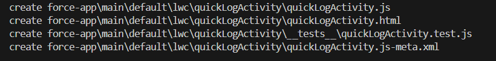
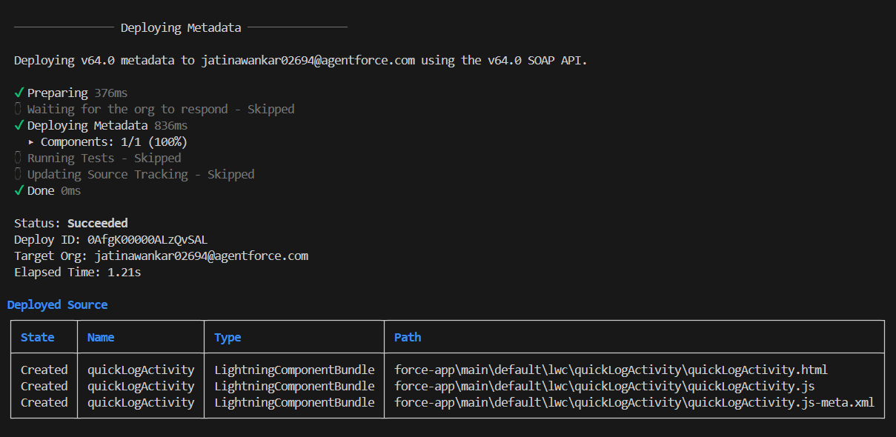

# Phase 8: Data Management (Optional) & Deployment (GreenTrack)


## 1) Why This Phase Matters
- Data must be imported, cleaned, backed up.
- Deployment shows I can move my work from dev org → GitHub.


## 2) Data Import – Add Sample Activities
Tool: Data Import Wizard (simpler) OR Data Loader (for bulk).<br>
Option A: Data Import Wizard
- Setup → Quick Find → Data Import Wizard
- Choose  Eco Activity object.
- Upload a CSV with sample data, e.g.:
    ```
    Activity Name, Activity Type, Trees Planted, Waste Recycled, Date, Location
    Plantation Drive, Tree Plantation, 50, , 2025-01-10, Pune
    Recycling Event, Recycling, , 20, 2025-02-20, Mumbai
    Awareness Session, Awareness Drive, , , 2025-03-30, Delhi
    ```
- Map fields → Start Import.

Option B: Data Loader (more powerful)
- Download Data Loader from Setup → Data Management.
- Login with Developer Edition credentials.
- Use Insert to bulk upload Eco Activities, Impact Scores, or Badges.


## 3) Data Export & Backup
For data safety.
- Setup → Quick Find → Data Export.
- Schedule weekly export of all objects (Eco Activity, Impact Score, Badge).
- Download .zip backup.


## 4) Duplicate Rules
Prevent duplicate activities (e.g., same user logs same activity twice).
- Setup → Duplicate Rules → New Rule → Object: Eco Activity.
- Matching criteria: Name + Date + User.
- Action: Alert + Block save.


## 5) VS Code & SF for Deployment
- Create quicklogactivity:<br>
```sf lightning generate component --name quickLogActivity --type lwc --output-dir force-app/main/default/lwc```


- Pull metadata (objects, flows, lwc, triggers) into local folder:<br>
```sf retrieve metadata --manifest ./manifest/package.xml --target-org GreenTrack --output-dir ./mdapipkg```


- Commit to GitHub:
    ```
    git add
    git commit -m "Org fetch - All"
    git push
    ```
